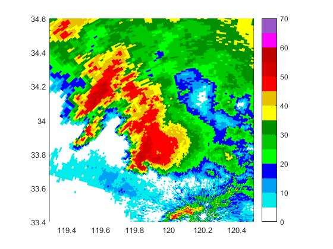
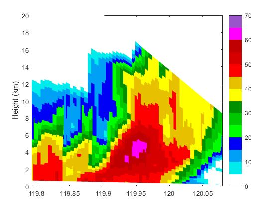
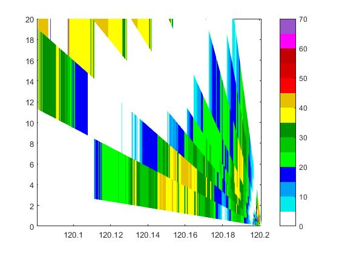
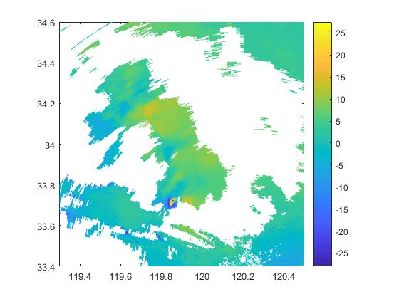
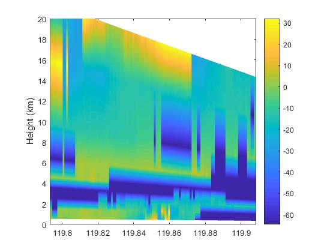
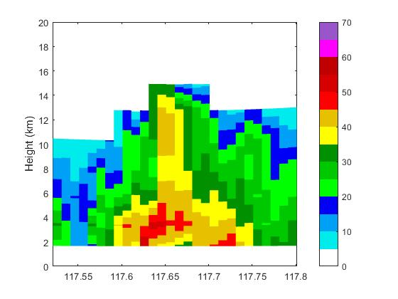
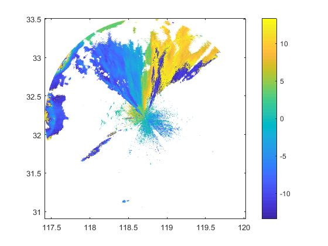

# mradar

## 处理雷达数据的matlab程序包

### 支持的雷达数据格式：

   * SA/SB 波段雷达基数据
   * 南信大 C 波段双偏振多普勒雷达

其它有待添加

### 支持的功能：

  * 根据 PPI 扫描数据，通过给定起始点和终点坐标或给定中点坐标和角度提取任意剖面数据
  * 根据 PPI 扫描数据，给定任意方位角，提取RHI扫描数据

## 使用方法

下载源码之后将源码放到 mradar 文件夹中，然后在 mradar 路径下执行 setup_mradar 函数即可将添加路径

`>> setup_mradar`

如果所有测试数据均在 data 子文件夹内，可在 mradar 路径下直接运行测试程序

`>> sband_demo`

## 效果图

*  **S 波段雷达**

 基本反射率 

      

 任意剖面图 

      

 固定方位角RHI 

      

 
 
 径向速度PPI 

	

 
 

 径向速度任意剖面 

	

 

* **C波段双偏振雷达**

 基本反射率 

	

 

 基本反射率剖面图 

	

 

 径向速度PPI 

	

 

## 功能扩展

如果要使用 utils 的工具函数，在处理其它雷达数据格式时，数据输出要和工具函数的输入相符合，数据输出为以下格式（在matlab中为结构体）：

                                                    | data
                                     | elevation(1) | eleva
              | products | elevation |   ...           ...
              |                      | elevation(n) | data
              |                                     | eleva
              |                                                  | data
              |                                       | longitude| units
        radar |                        |              | latitude | 同上
              |                        | elevation(1) | height   | 
              |                        |              | azimuth
              |                        |              | elevation
              | coordinate | elevation | ....
              |                        |
              |                        |              | longitude
              |                        |              | latitude
              |                        | elevation(n) | height
              |                  | data               | azimuth
              |      | longitude | units              | elevation
              | info | latitude  | 同上
                     | height    | 同上
                     | elenum  

